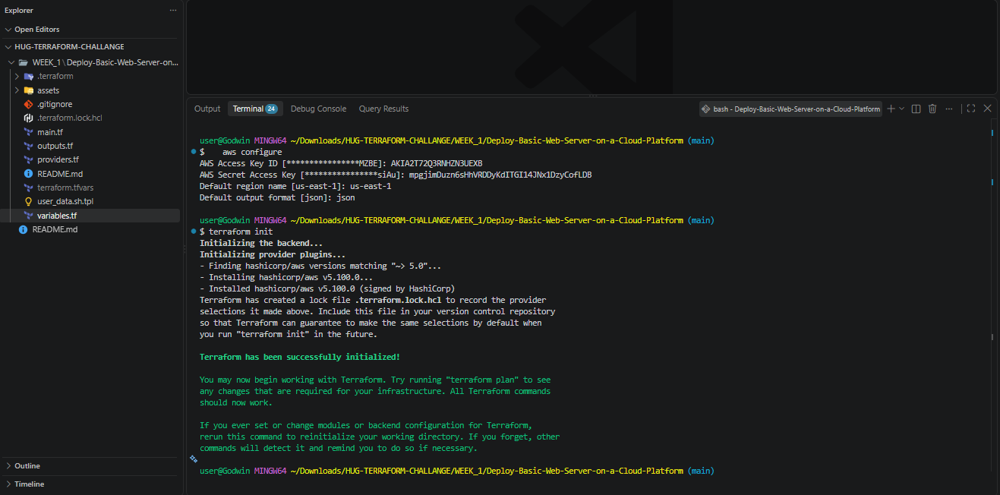
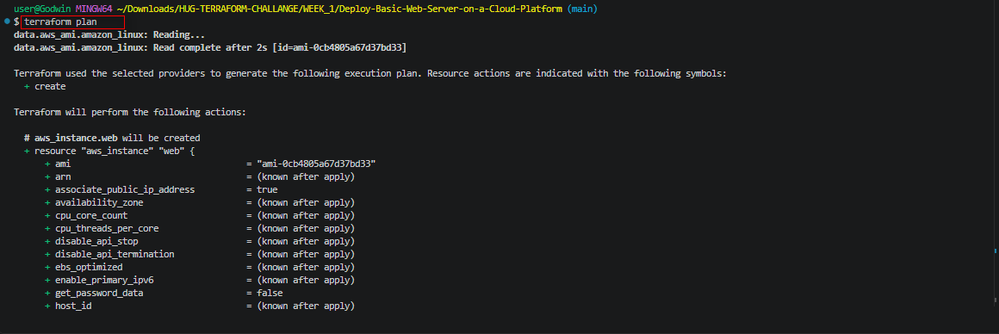
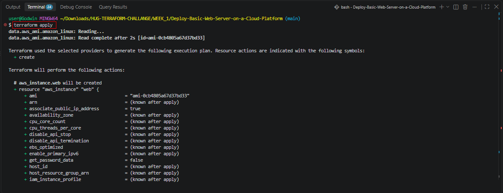
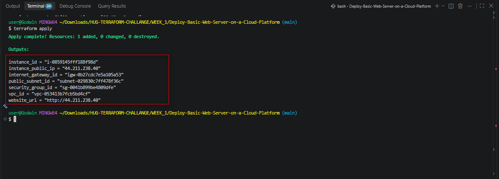
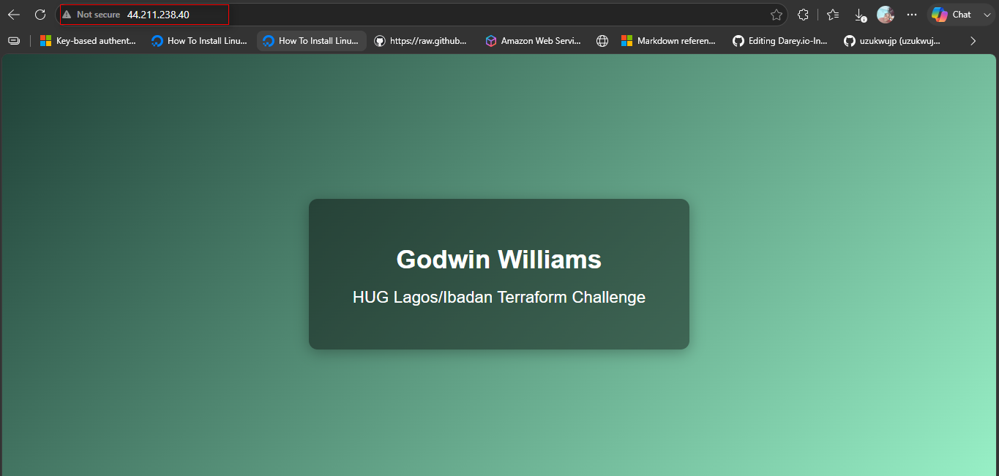
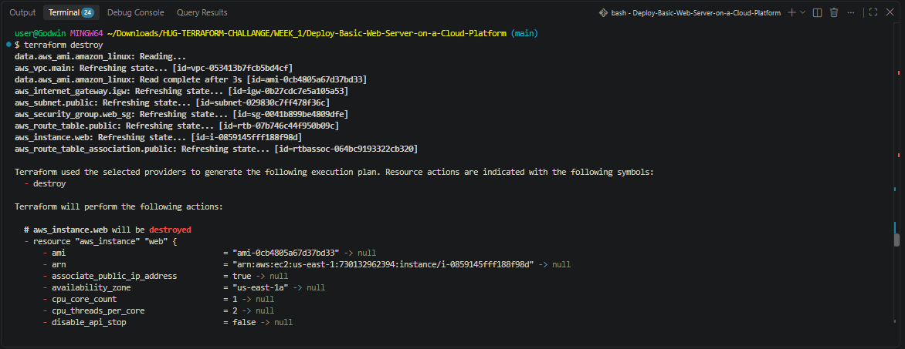
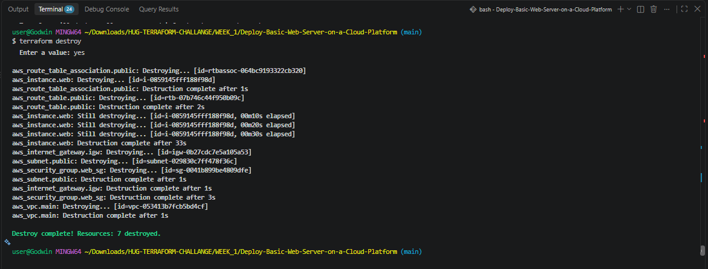
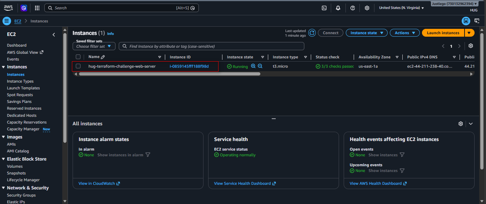

# Project 1 – Deploy a Basic Web Server on AWS with Terraform

## HUG Lagos/Ibadan Terraform Challenge

This project provisions a simple, self-contained web server on AWS using
Terraform. It stands up its own networking from scratch (VPC, public subnet,
Internet Gateway, route table) and launches an EC2 instance running Nginx
that serves a landing page displaying the deployer's name and the challenge
name.

**Live deployment:** `http://44.211.238.40`

---

## Architecture

```text
                        Internet
                            │
                    ┌───────▼────────┐
                    │ Internet Gateway│
                    └───────┬────────┘
                            │
                    ┌───────▼────────┐
                    │  Route Table    │  (0.0.0.0/0 → IGW)
                    └───────┬────────┘
                            │
        ┌───────────────────────────────────┐
        │      Custom VPC (10.0.0.0/16)      │
        │  ┌───────────────────────────────┐ │
        │  │  Public Subnet (10.0.1.0/24)  │ │
        │  │                                │ │
        │  │   ┌────────────────────────┐  │ │
        │  │   │   EC2 Instance (Nginx)  │  │ │
        │  │   │   Security Group:       │  │ │
        │  │   │   - SSH  (22)           │  │ │
        │  │   │   - HTTP (80)           │  │ │
        │  │   └────────────────────────┘  │ │
        │  └───────────────────────────────┘ │
        └───────────────────────────────────┘
```

## Resources Created

| Resource | Terraform Type | Purpose |
| --- | --- | --- |
| Custom VPC | `aws_vpc` | Isolated network for the project |
| Public Subnet | `aws_subnet` | Hosts the EC2 instance, auto-assigns public IPs |
| Internet Gateway | `aws_internet_gateway` | Gives the VPC internet access |
| Route Table + Association | `aws_route_table`, `aws_route_table_association` | Routes 0.0.0.0/0 traffic to the IGW |
| Security Group | `aws_security_group` | Allows inbound SSH (22) and HTTP (80) |
| EC2 Instance | `aws_instance` | Amazon Linux 2023 host running Nginx |
| AMI Lookup | `data.aws_ami` | Dynamically finds the latest Amazon Linux 2023 AMI |

## File Structure

```text
user@Godwin MINGW64 ~/Downloads/HUG-TERRAFORM-CHALLANGE/WEEK_1 (main)
$ tree
.
`-- Deploy-Basic-Web-Server-on-a-Cloud-Platform
    |-- README.md
    |-- assets
    |   `-- images
    |       |-- wk1_1.png
    |       |-- wk1_2.png
    |       |-- wk1_3.png
    |       |-- wk1_4.png
    |       |-- wk1_5.png
    |       |-- wk1_6.png
    |       |-- wk1_7.png
    |       `-- wk1_8.png
    |-- main.tf
    |-- outputs.tf
    |-- providers.tf
    |-- terraform.tfstate
    |-- terraform.tfstate.backup
    |-- terraform.tfvars
    |-- user_data.sh.tpl
    `-- variables.tf
```

## Prerequisites

1. An AWS account with permissions to create VPC, EC2, and networking resources.
2. [Terraform](https://developer.hashicorp.com/terraform/downloads) >= 1.5.0 installed locally.
3. [AWS CLI](https://docs.aws.amazon.com/cli/latest/userguide/getting-started-install.html) installed and configured with credentials:

   ```bash
   aws configure
   ```

4. (Optional, for SSH access) An existing EC2 key pair in the target region — create it first via the EC2 Console or:

   ```bash
   aws ec2 create-key-pair --key-name HUG --region us-east-1 \
     --query 'KeyMaterial' --output text > ~/.ssh/HUG.pem
   ```

   Then set `key_name = "HUG"` (no `.pem`) in `terraform.tfvars`.

## Deployment Instructions

### 1. Clone the repository

```bash
git clone <your-github-repo-url>
cd hug-terraform-challenge
```

### 2. Configure your variables

Copy the example variables file and edit it with your details:

```bash
cp terraform.tfvars.example terraform.tfvars
```

Edit `terraform.tfvars`:

```hcl
full_name        = "Your Firstname Lastname"
ssh_allowed_cidr = "YOUR_PUBLIC_IP/32"   # find it via `curl ifconfig.me`
key_name         = "HUG"                 # optional, leave "" to skip SSH key
instance_type    = "t3.micro"            # confirm this is Free Tier-eligible in your account/region
```

> **Note on `instance_type`:** Free Tier eligibility varies by account age and
> region. If `terraform apply` fails with
> `InvalidParameterCombination: The specified instance type is not eligible for Free Tier`,
> check which types your account qualifies for with:
>
> ```bash
> aws ec2 describe-instance-types --region us-east-1 \
>   --filters "Name=free-tier-eligible,Values=true" \
>   --query "InstanceTypes[].InstanceType" --output table
> ```
>
> and set `instance_type` accordingly (this project was deployed successfully with `t3.micro`).

### 3. Initialize Terraform

```bash
terraform init
```



### 4. Review the execution plan

```bash
terraform plan
```



### 5. Apply the configuration

```bash
terraform apply
```



Type `yes` when prompted. Provisioning takes about 1–2 minutes.

### 6. Get the website URL

Terraform prints outputs at the end:

```text
instance_id         = "i-0859145fff188f98d"
instance_public_ip  = "44.211.238.40"
website_url         = "http://44.211.238.40"
```



Open the `website_url` in a browser. Allow 30–60 seconds after the instance
reaches "running" for `user_data` to finish installing Nginx.



### 7. (Optional) SSH into the instance

```bash
ssh -i ~/.ssh/HUG.pem ec2-user@44.211.238.40
```

### 8. Tear down when done

```bash
terraform destroy
```




Type `yes` to confirm and avoid ongoing AWS charges.

## How It Works

- **Networking**: A custom VPC (`10.0.0.0/16`) is created with one public
  subnet (`10.0.1.0/24`). An Internet Gateway is attached to the VPC, and a
  route table sends all outbound traffic (`0.0.0.0/0`) through the gateway.
  The subnet is associated with this route table, and
  `map_public_ip_on_launch = true` ensures the instance gets a public IP
  automatically.
- **Security**: A single security group allows inbound SSH (port 22, ideally
  restricted to your IP via `ssh_allowed_cidr`) and HTTP (port 80, open to
  everyone so the page is publicly viewable). All outbound traffic is allowed.
- **Compute**: The latest Amazon Linux 2023 AMI is looked up dynamically via
  a `data "aws_ami"` block, so the AMI ID is never hardcoded. The instance is
  launched inside the public subnet with the security group attached.
- **Bootstrapping**: The `user_data.sh.tpl` script runs on first boot. It
  installs Nginx, and uses Terraform's `templatefile()` function to render an
  `index.html` page that displays `var.full_name` and `var.event_name`. It
  then enables and starts the Nginx service.
- **Dependencies**: Terraform automatically infers most dependencies from
  resource references (e.g., the subnet references the VPC ID, the route
  references the IGW ID). An explicit `depends_on = [aws_internet_gateway.igw]`
  is added on the EC2 instance to guarantee the gateway is live before the
  instance boots and tries to reach the internet for package installs.

## Screenshots

### Web Page


### EC2 Instance Running (AWS Console)



## Customization

| Variable | Default | Description |
| --- | --- | --- |
| `aws_region` | `us-east-1` | AWS region to deploy into |
| `vpc_cidr` | `10.0.0.0/16` | VPC CIDR block |
| `public_subnet_cidr` | `10.0.1.0/24` | Public subnet CIDR block |
| `availability_zone` | `us-east-1a` | AZ for the subnet |
| `instance_type` | `t3.micro` | EC2 instance size (Free Tier eligible) |
| `key_name` | `""` | Existing EC2 key pair name for SSH |
| `ssh_allowed_cidr` | `0.0.0.0/0` | CIDR allowed to SSH — restrict this! |
| `full_name` | `Firstname Lastname` | Name shown on the web page |
| `event_name` | `HUG Lagos/Ibadan Terraform Challenge` | Event name shown on the web page |

## Cost Note

`t3.micro` is eligible for the AWS Free Tier on many accounts (verify via
the `describe-instance-types` command above). Outside the free tier, this
setup costs only pennies per hour. Run `terraform destroy` when done to
avoid ongoing charges.

## Troubleshooting

- **`InvalidKeyPair.NotFound`**: the `key_name` in `terraform.tfvars` must
  match an EC2 key pair that already exists **in the same region**, and must
  be the key pair *name* (e.g. `HUG`), not the downloaded filename (`HUG.pem`).
- **`InvalidParameterCombination: ... not eligible for Free Tier`**: your
  account's free-tier instance type differs from the default in this
  project. Check eligible types and update `instance_type` (see step 2 above).
- **Page not loading**: wait ~60 seconds after `terraform apply` completes
  for `user_data` to finish; check `/var/log/cloud-init-output.log` on the
  instance via SSH if it still doesn't load.
- **SSH connection refused**: confirm `ssh_allowed_cidr` includes your
  current public IP and that `key_name` matches a key pair in the same region.
