# Two-Tier Application Deployment on AWS (Terraform)

Provisions a secure, two-tier architecture on AWS using modular Terraform:
a public-facing Nginx web server and a private, non-public RDS database,
wired together with least-privilege security groups and remote state.

## Architecture

```
                          Internet
                             │
                    ┌────────▼────────┐
                    │ Internet Gateway │
                    └────────┬────────┘
                             │
                    ┌────────▼─────────┐          VPC (10.0.0.0/16)
                    │  Public Subnet    │
                    │  10.0.1.0/24      │
                    │                   │
                    │  ┌─────────────┐  │
                    │  │  EC2 + Nginx│  │◄── SSH (22) from your IP only
                    │  │  web-sg     │  │◄── HTTP/HTTPS (80/443) from 0.0.0.0/0
                    │  └──────┬──────┘  │
                    └─────────┼─────────┘
                              │ NAT Gateway (outbound only)
                    ┌─────────▼─────────┐
                    │  Private Subnets  │
                    │  10.0.2.0/24      │
                    │  10.0.3.0/24      │
                    │                   │
                    │  ┌─────────────┐  │
                    │  │  RDS (MySQL)│  │◄── DB port only from web-sg
                    │  │  db-sg      │  │    (never publicly accessible)
                    │  └─────────────┘  │
                    └───────────────────┘
```

Two private subnets (in two AZs) are provisioned instead of one, because AWS
requires an RDS DB subnet group to span at least two Availability Zones —
they function together as a single logical private tier.

## Project Structure

```
user@Godwin MINGW64 ~/Downloads/HUG-TERRAFORM-CHALLANGE/WEEK_3/Deploy-a-Two-Tier-Application-on-a-Cloud-Platform (main)
$ tree
.
|-- README.md
|-- assets
|   `-- images
|-- backend.tf
|-- bootstrap
|   |-- main.tf
|   |-- outputs.tf
|   `-- variables.tf
|-- main.tf
|-- modules
|   |-- compute
|   |   |-- main.tf
|   |   |-- outputs.tf
|   |   |-- user_data.sh.tpl
|   |   `-- variables.tf
|   |-- database
|   |   |-- main.tf
|   |   |-- outputs.tf
|   |   `-- variables.tf
|   |-- security
|   |   |-- main.tf
|   |   |-- outputs.tf
|   |   `-- variables.tf
|   `-- vpc
|       |-- main.tf
|       |-- outputs.tf
|       `-- variables.tf
|-- outputs.tf
|-- providers.tf
|-- terraform.tfvars.example
`-- variables.tf
```

## Prerequisites

- [Terraform](https://developer.hashicorp.com/terraform/downloads) >= 1.5.0
- An AWS account and credentials configured (`aws configure` or environment variables)
- An existing EC2 key pair in your target region (for SSH access)
- Your current public IP address (`curl ifconfig.me`)

## Deployment Instructions

### 1. Bootstrap remote state (one-time setup)

Terraform can't create the S3 bucket it will use to store its own state, so
this is done first with local state:

```bash
cd bootstrap
terraform init
terraform apply
```

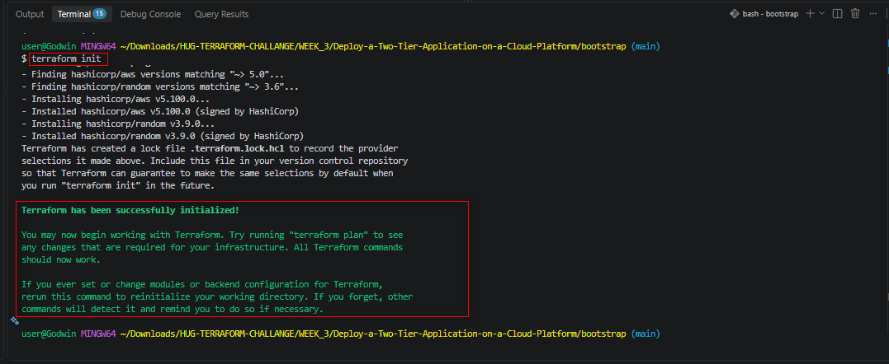
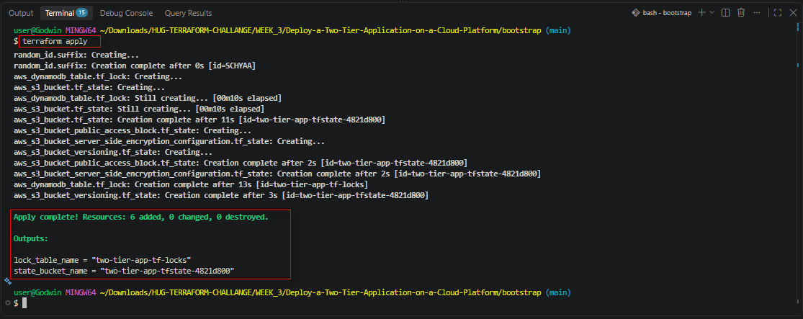


Note the outputs — `state_bucket_name` and `lock_table_name`.

### 2. Configure the backend

Edit `backend.tf` in the project root and replace the placeholder values
with the outputs from step 1:

```hcl
terraform {
  backend "s3" {
    bucket         = "two-tier-app-tfstate-xxxxxxxx"
    key            = "two-tier-app/terraform.tfstate"
    region         = "us-east-1"
    dynamodb_table = "two-tier-app-tf-locks"
    encrypt        = true
  }
}
```

### 3. Configure your variables

```bash
cp terraform.tfvars.example terraform.tfvars
```

Edit `terraform.tfvars` and set, at minimum:
- `my_ip_cidr` — your public IP in CIDR form, e.g. `203.0.113.5/32`
- `key_name` — the name of your existing EC2 key pair
- `db_password` — a strong password (better yet, source this from AWS
  Secrets Manager or a `TF_VAR_db_password` environment variable rather
  than committing it to a file)

### 4. Initialize, plan, and apply

```bash
terraform init
terraform plan
terraform apply
```

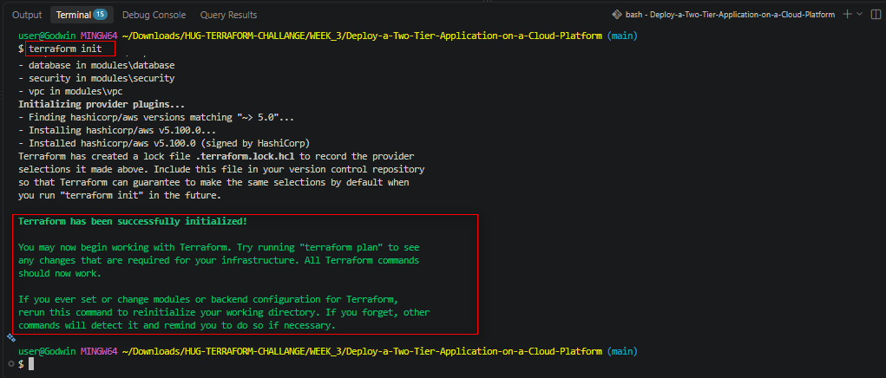
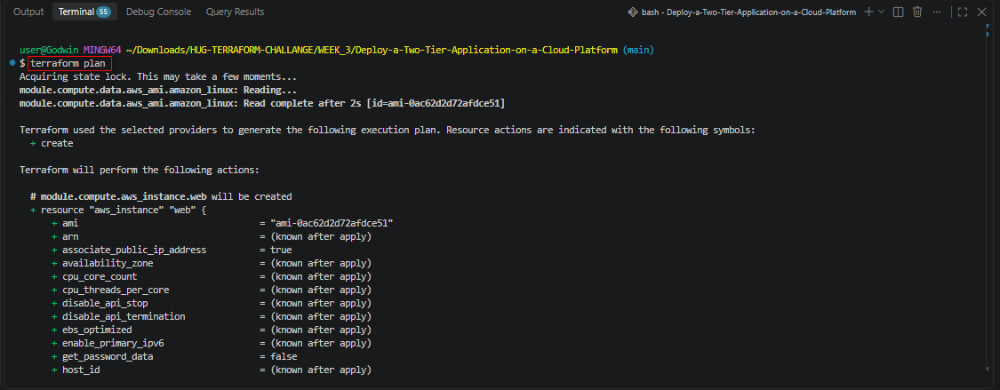
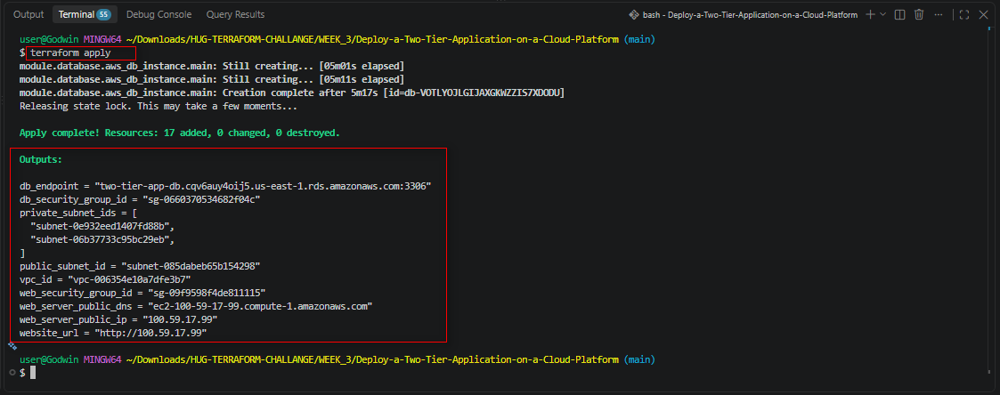


### 5. Verify the deployment

```bash
terraform output website_url
curl $(terraform output -raw website_url)
```

Open the URL in a browser to see the deployed webpage.

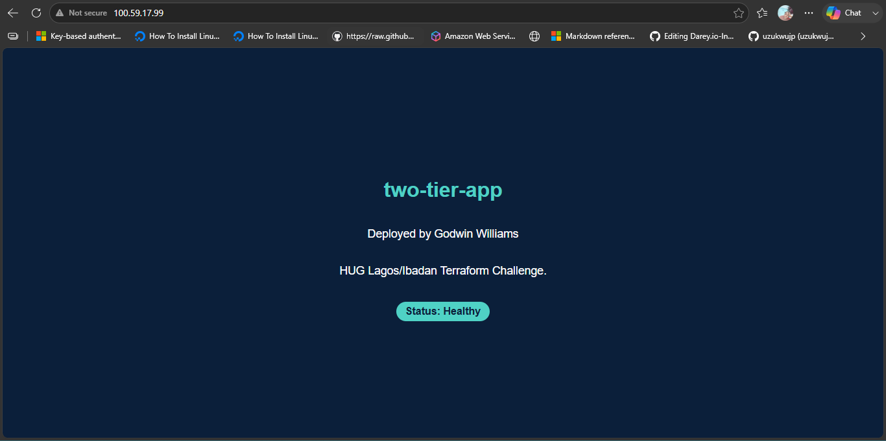


SSH is available only from the IP address you configured: That is if you intend to access the instance

```bash
ssh -i /path/to/your-key.pem ec2-user@$(terraform output -raw web_server_public_ip)
```

### 6. Tear down

```bash
terraform destroy
cd bootstrap && terraform destroy   # only once you no longer need remote state
```

## Security Design

| Control                                   | Implementation                                                             |
|--------------------------------------------|-----------------------------------------------------------------------------|
| HTTP(S) reachable from the internet        | `web-sg` allows ports 80/443 from `0.0.0.0/0`                              |
| SSH restricted to operator                 | `web-sg` allows port 22 only from `var.my_ip_cidr`                        |
| Database reachable only from web tier      | `db-sg` allows the DB port only from `web-sg`'s security group ID          |
| Database never publicly accessible         | `publicly_accessible = false` and DB lives only in private subnets        |
| Database has no route to the internet      | Private subnets route outbound traffic through a NAT Gateway, not an IGW  |
| Storage encrypted at rest                  | RDS `storage_encrypted = true`; state bucket uses SSE-S3                  |
| State locking / no concurrent corruption   | DynamoDB lock table referenced in `backend.tf`                            |

## Customization via Variables

Key variables you can tune in `terraform.tfvars` (see `variables.tf` for the
full list and defaults):

- `db_instance_class`, `db_allocated_storage`, `db_engine`, `db_engine_version`
- `instance_type` for the EC2 web server
- `vpc_cidr`, `public_subnet_cidr`, `private_subnet_cidrs`
- `tags` — applied to every resource for cost tracking and ownership


## Deliverables

`VPC`

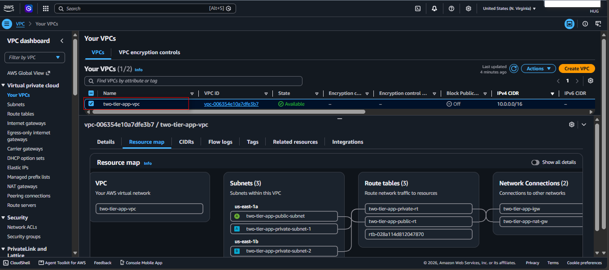


`Compute Instance`

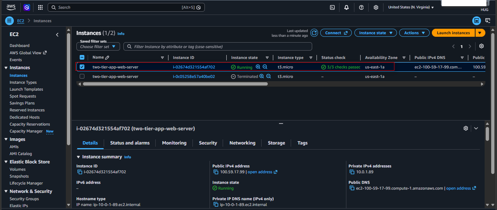


`RDS Database Instance`

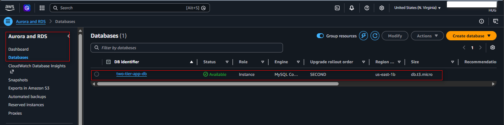


`Remote State`

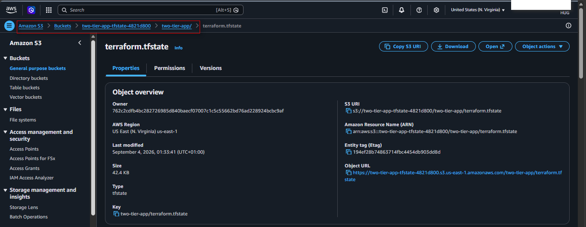
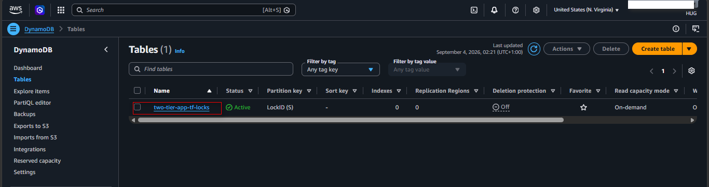

